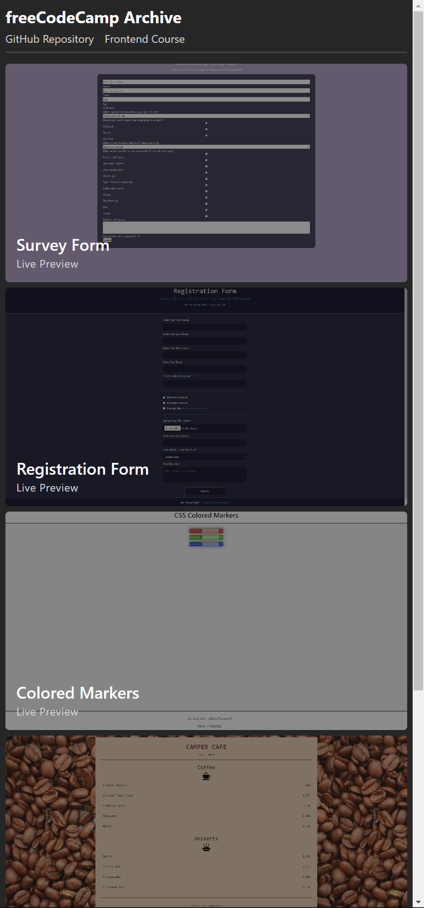
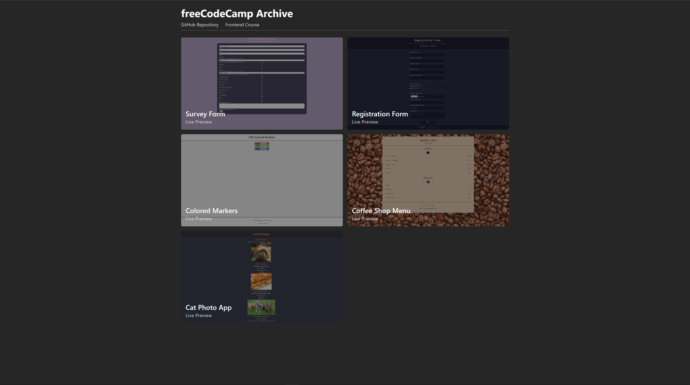

<h1 align="center">freeCodeCamp Frontend Course</h1>

## Table of contents

- [Table of contents](#table-of-contents)
- [About](#about)
- [Screenshots](#screenshots)
- [Built with](#built-with)
- [Links](#links)
- [License](#license)

## About

This is the archive of all of my projects and tasks from the FreeCodeCamp course. They all were made a while ago using vanilla CSS and no JavaScript

## Screenshots

## Built with

## Links

- [Live Preview](https://seesmof.github.io/testimonials-grid-section/)

## License

This project is licensed under the [MIT License](./LICENSE).

<a href="#readme-top"><strong>Back to top</strong></a>

