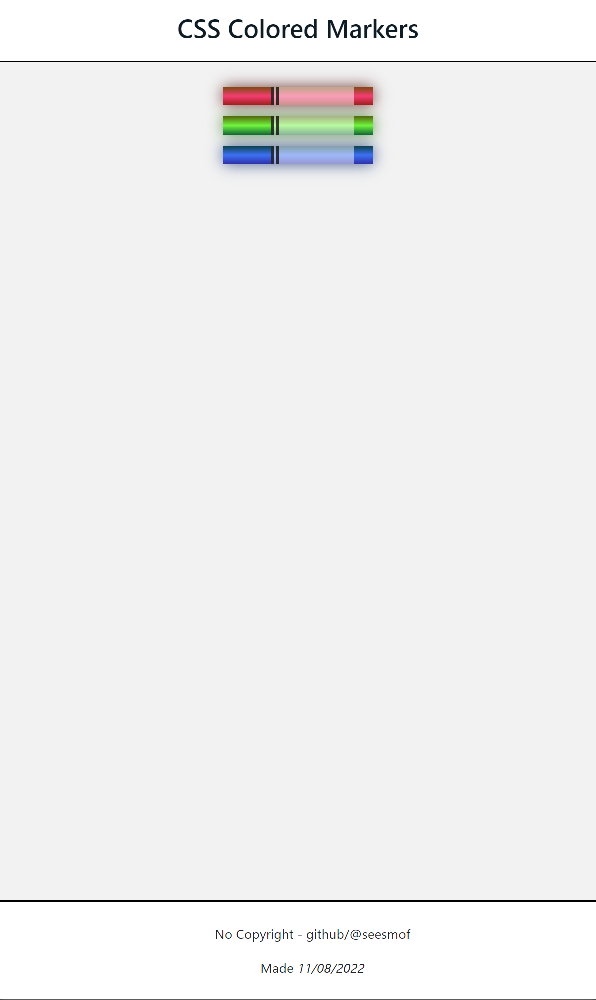

<h1 align="center">Colored Markers - freeCodeCampt</h1>

## Table of contents

- [Table of contents](#table-of-contents)
- [About](#about)
- [Screenshots](#screenshots)
- [Built with](#built-with)
- [Links](#links)
- [License](#license)

## About

Simple one-page application that contains three colored markers, as well as a custom header and footer sections. Was made as part of the freeCodeCamp course and HTML with SASS were used

## Screenshots

## Built with

## Links

- [Live Preview](https://seesmof.github.io/colored-markers_fcc/)

## License

This project is licensed under the [MIT License](./LICENSE).

<a href="#readme-top"><strong>Back to top</strong></a>

